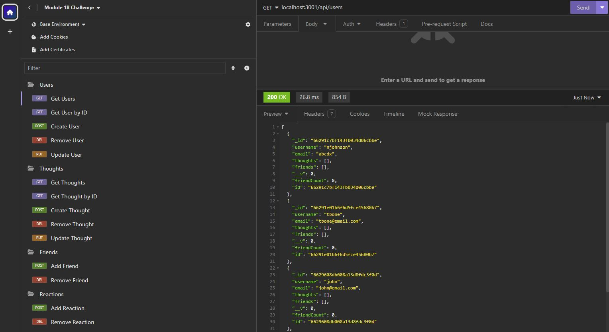

# Social Network Database Project

## Description
This project entailed the creation of a NoSQL database for a social network website with multiple collections containing data on the social network's users, the "thoughts" that they post, as well as the user's "friends" and the "reactions" that they might have to other users' posts. Additionally, the project necessitated the creation of various api routes to get, add, update, or delete information from the database.  

## Installation
This is a node project, so installation of this project will require the user to have the latest version of nodejs downloaded.  Further, this project necessitates the use of MongoDB, which the user must also have downloaded. 

To install this project, one must first clone this repo to their local device.  Then, navigate to the repository in their local integrated development environment and install the necessary packages using the "npm install" command in the terminal.  This will install the necessary npm packages for this project, namely express and mongoose.  

The user will then need to create their database within MongoDB by utilizing the database's client, MongoDB Compass.  Having done this, the user can now run the program from the terminal with the command "npm start".  The api requests can then be made through Insomnia or another similar client.

## Usage
The following is a screenshot of an Insomnia client indicating the types and number of routes that this project can accomodate, as well as a portion of the response received from an example "get all" route:

The following is a link to a walkthrough video that demonstrates all of the functionality of the program:
[Social Network Database Walkthrough Video]()

## Contributing
N/A

## Tests
N/A

## Credits
This application draws heavily from the Module 18 mini project, particularly for the syntax of the api routes.  Additionally, I received a lot of help from a bootcamp tutor,  Jaytee Padilla, specifically on debugging some DELETE routes as well as in creating the helper function used to format dates in the models' getter methods.

